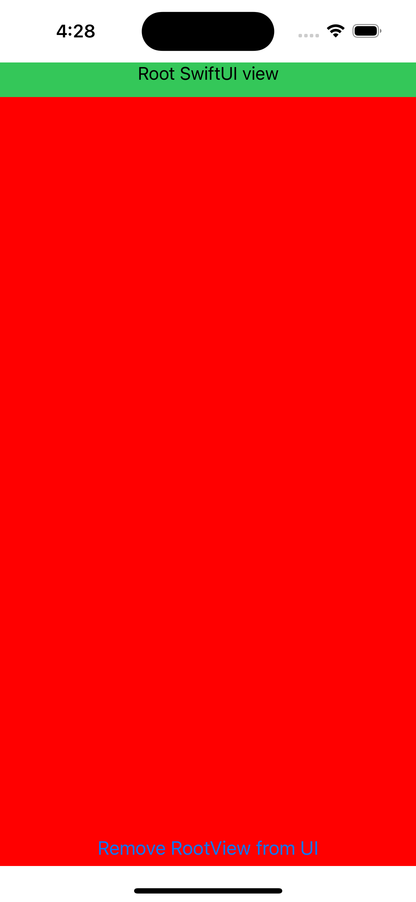

# swiftUI-env-lifecycle

A project containing some scenarios on when the `SwiftUI` environment gets retained, for 
apps integrating `UIKit` with `SwiftUI` and vice-versa.

## The scenarios:

1. Holding a `View` instance
2. Holding a reference to a `UIHostingController` instance 
3. Having a `UIView` with a retain cycle
4. Having a retain cycle between a `UIView` and an environment object

## Exploring the scenarios

Each scenario has a git tag pointing to it. To explore the scenarios, do the following:

1. Begin by checking it out: e.g `git checkout scenario-1`
2. Run the app in the simulator
3. Tap the "Remove RootView from UI" button (when applicable)
4. Build [the memory graph](https://developer.apple.com/documentation/xcode/gathering-information-about-memory-use#Inspect-the-debug-memory-graph) and look for the environment instances (`EnvA` and `EnvB`)
5. Fix the scenario, properly releasing the environment, making sure it doesn't appear in the memory graph
6. When you are done, you can return to git's HEAD: `git switch -`

Make sure to check this [blog post](https://tiagolopes.blog/2022/11/01/when-does-a-swiftui-environment-get-retained/) as well. It'll guide your experience.

## The project UI

Some scenarios might require you to remove the SwiftUI views from the screen. You can do this by 
tapping at the "Remove RootView from UI" button:

